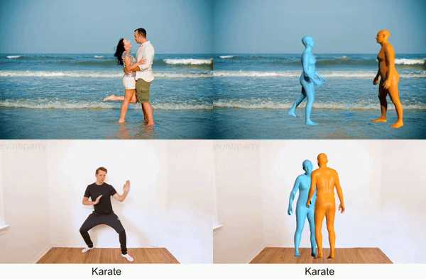
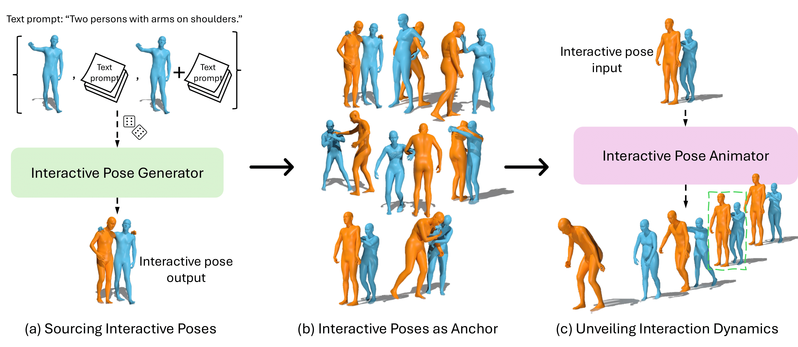
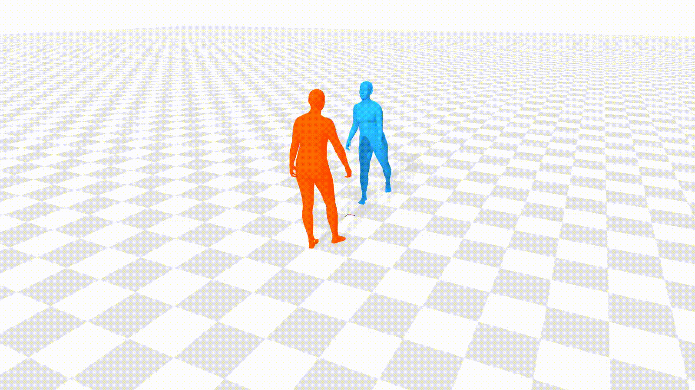
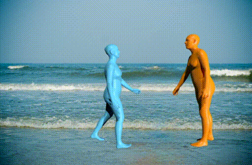
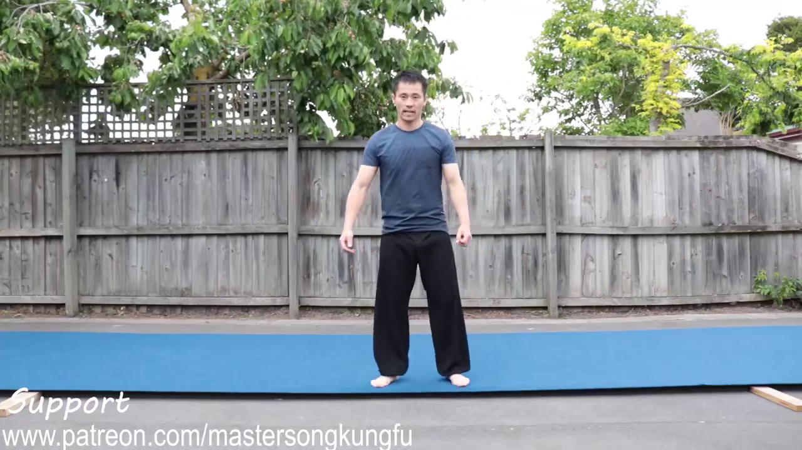
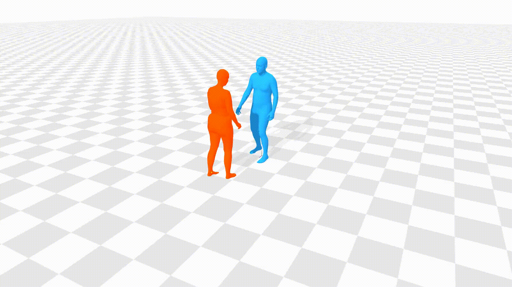
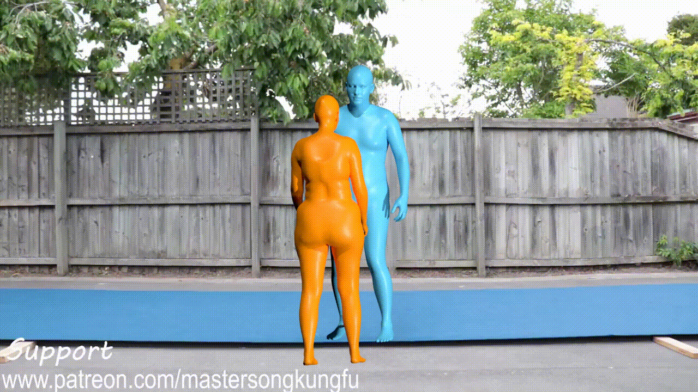
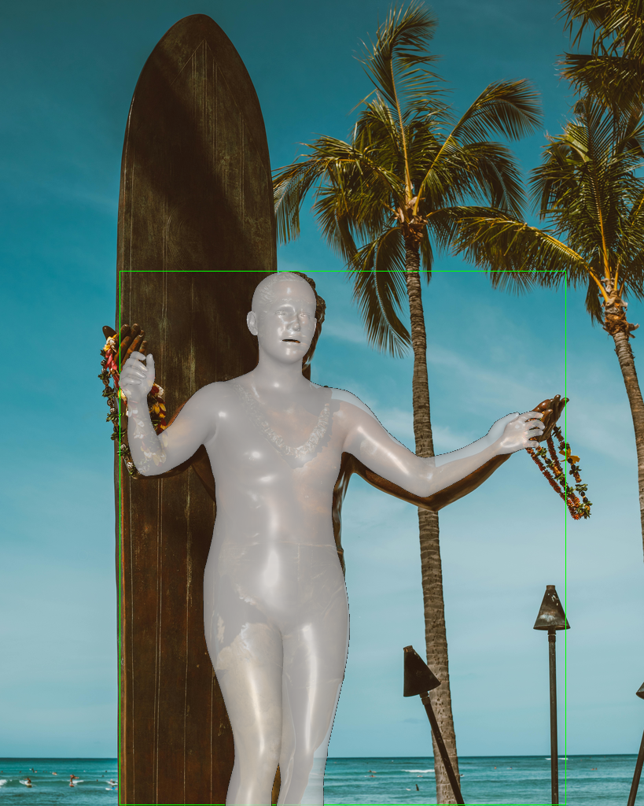
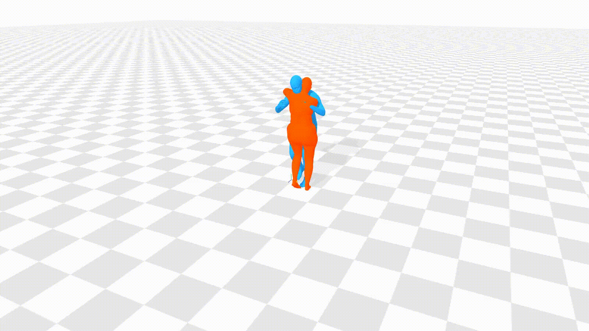
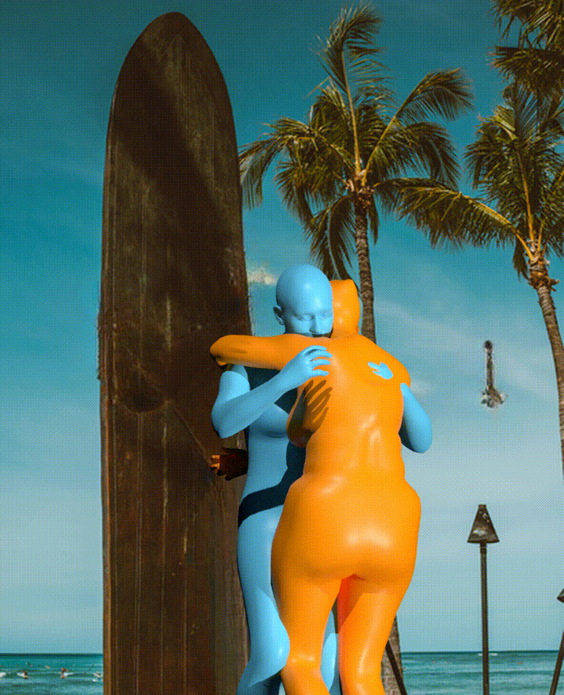

<br />
<p align="center">

  <h1 align="center">Ponimator: Unfolding Interactive Pose for Versatile Human-human
Interaction Animation</h1>

  <p align="center">
   ICCV, 2025
    <br />
    <a href="https://stevenlsw.github.io"><strong>Shaowei Liu</strong></a>
    ·
    <a href="https://ericguo5513.github.io/"><strong>Chuan Guo*</strong></a>
    ·
    <a href="https://zhoubinwy.github.io/"><strong>Bing Zhou*</strong></a>
    ·
    <a href="https://jianwang-cmu.github.io/"><strong>Jian Wang*</strong></a>
    ·
  </p>

<p align="center"> 

</p>

  <p align="center">
    <a href='https://arxiv.org/pdf/2510.14976'>
      </a>
    <a href='https://arxiv.org/abs/2510.14976'></a>
    <a href='https://stevenlsw.github.io/ponimator/' style='padding-left: 0.5rem;'>
      </a>
    <!-- <a href='' style='padding-left: 0.5rem;'></a>
    <a href='https://youtu.be/' style='padding-left: 0.5rem;'>
      </a> -->
  </p>

</p>
<br />

This repository contains the pytorch implementation for the paper [Ponimator: Unfolding Interactive Pose for Versatile Human-Human Interaction Animation](https://stevenlsw.github.io/ponimator/), ICCV 2025. In this paper, we propose a uniform framework for human-human interaction animation and generation anchored on interactive poses.

## Overview


## 📄 Table of Contents

- [Installation](#installation)
- [Interactive Pose Animation Demo](#interactive-pose-animation-demo)
- [Interactive Motion Generation Demo](#interactive-motion-generation-demo)
- [Training and Inference](#training-and-inference)
- [Custom Third-party Scripts](#custom-third-party-scripts)
- [Citation](#citation)

## Installation
- Clone this repository: 
    ```Shell
    git clone https://github.com/stevenlsw/ponimator.git
    cd ponimator
    ```
- Our code has minimal dependencies:
    ```Shell
    # most version of python and pytorch should all work
    conda create -n ponimator python=3.10
    conda activate ponimator
    pip3 install torch torchvision --index-url https://download.pytorch.org/whl/cu124
    pip3 install aitviewer yacs roma git+https://github.com/openai/CLIP.git
    ```

- [Optional] Install visualization dependencies:
  ```Shell
  pip install blendify --find-links https://download.blender.org/pypi/bpy/
  pip install imageio[ffmpeg]
  ```

- Prepare [SMPL-X body models](https://smpl-x.is.tue.mpg.de/), you can download a minimal version from [minmal smplx folder](https://drive.google.com/drive/folders/1ZW2yU4g4RBhZlTSD415kgihgTMnEMZgS?usp=sharing) and put smplx folder under `body_models/`
  ```Shell
  body_models/ 
    ├── smplx
      ├── SMPLX_MALE.npz
      ├── SMPLX_FEMALE.npz
      ├── SMPLX_NEUTRAL.npz
      ├── SMPLX_MALE.pkl
      ├── SMPLX_FEMALE.pkl
      ├── SMPLX_NEUTRAL.pkl
  ```

- Download pretrained checkpoints:
  [Interactive Pose Animator](https://huggingface.co/shaoweiliu/ponimator/resolve/main/contactmotion.ckpt) and [Interactive Pose Generator](https://huggingface.co/shaoweiliu/ponimator/resolve/main/contactpose.ckpt) and put under `checkpoints/`
    ```Shell
  checkpoints/ 
    ├── contactmotion.ckpt
    ├── contactpose.ckpt
  ```

## Interactive Pose Animation Demo

- [Optional] Given an interactive pose image, you can estimate the interactive pose by [buddi](https://github.com/muelea/buddi) check [custom third-party scripts](#custom-third-party-scripts)

- We put buddi demo outputs under `data/buddi/{video_name}`, you can generate interactive motion by:
  ```Shell
  python scripts/run_pose2motion.py --data_dir data/buddi/Couple_6806 --save
  ```
- Visualize the interactive pose by append `--vis_interactive_pose` to above command. For off-screen rendering, you can add `xvfb-run -a -s "-screen 0 1024x768x24"` before the command. The output video will be saved under `outputs/Couple_6806`. You can also turn off visualization by append `--disable_vis` to the command. The output video will be saved under `outputs/Couple_6806/vis_motion_pred.mp4`.

- [Optional] To render the generated motion on original image:

  ```Shell
  python demo/vis_smpler.py --data_dir data/buddi/Couple_6806 --result_dir outputs/Couple_6806
  ```
  The output video will be saved under `outputs/Couple_6806/render_motion_pred.mp4`.

- You are expected to get the following result:

  | **Input Image** | **Generated MOtion** | **Output Video** |
  |:---------------:|:--------------:|:----------------:|
  |  |  |  |


## Interactive Motion Generation Demo
- [Optional] Given an single-person image, you can use [SMPLer-X](https://github.com/SMPLCap/SMPLest-X) to estimate the single pose or animate existing single-person pose dataset like [Motion-X](https://github.com/IDEA-Research/Motion-X). See [custom third-party scripts](#custom-third-party-scripts) for more details.

- We put demo Motion-X data under `data/motionx/{video_name}`, you can generate interactive motion by:
  ```Shell
  python scripts/run_singlepose2motion.py --data_dir data/motionx/Back_Flip_Kungfu_wushu_Trim9_clip1 --save
  ```
  The output video will be saved under `outputs/Back_Flip_Kungfu_wushu_Trim9_clip1/vis_motion_pred.mp4`.
  You can adjust `--seed`, `--inter_time_idx`, `--gender`, `--text` for different outputs.

- [Optional] To render the generated motion on original image:
  ```Shell
  python demo/vis_motionx.py --data_dir data/motionx/Back_Flip_Kungfu_wushu_Trim9_clip1 --result_dir outputs/Back_Flip_Kungfu_wushu_Trim9_clip1
  ```
  The output video will be saved under `outputs/Back_Flip_Kungfu_wushu_Trim9_clip1/render_motion_pred.mp4`.

- You are expected to get the following result:
  | **Input Image** | **Generated MOtion** | **Output Video** |
  |:---------------:|:--------------:|:----------------:|
  |  |  |  |


## Custom Third-party Scripts
- Estimate Interactive Pose by [Buddi](https://github.com/muelea/buddi), a custom script is at `third_party_scripts/buddi/custom_demo.sh`, put under same directory as `buddi` root dir.
  ```Shell
  cd buddi/
  chmod +x /custom_demo.sh
  ./custom_demo.sh ${input_image_path} {gpu_id}
  ```

- Estimate Single Pose by [SMPLest-X](https://github.com/SMPLCap/SMPLest-X), a custom script is at `third_party_scripts/SMPLest-X/custom_inference.py`, put under same directory as `SMPLest-X/main` folder. 
  ```Shell
  cd SMPLest-X
  python main/custom_inference.py --file_name ${input_image_path} --ckpt_name smplest_x_h --output_folder ${output_folder} --save_pkl
  ```
- Example estimated single pose from SMPLest-X is shown as 
  | **Input Image** | **Estimated Single Pose** |
  |:---------------:|:--------------:|
  |  |  |
  - Quick Note: The example image is the most famous statue in Waikiki beach, Hawaii.

- Generate interactive motion of custom text `"two person hug each other"` by
  ```Shell
  python scripts/run_singlepose2motion.py --save  --data_dir data/smpler --data_source smpler  --text "two person hug each other" --seed 1 --save_dir outputs/smpler
  ```
  The default output is under `outputs/image_ori`.

  
- Render the output video on original image:
  ```Shell
  python demo/vis_smpler.py --data_dir data/smpler --result_dir outputs/image_ori
  ```
  The output video will be saved under `outputs/image_ori/rendered_video.mp4`.

- You are expected to get the following result:
  | **Input Image** | **Generated MOtion** | **Output Video** |
  |:---------------:|:--------------:|:----------------:|
  |  |  |  |


## Citation

If you find our work useful in your research, please cite:

```BiBTeX
@inproceedings{liu2025ponimator},
  title={Ponimator: Unfolding Interactive Pose for Versatile Human-Human Interaction Animation},
  author={Liu, Shaowei and Guo, Chuan and Zhou, Bing and Wang, Jian},
  booktitle={International Conference on Computer Vision (ICCV)},
  year={2025}
}
```


## Acknowledgement
Our model is based on [InterGen
](https://github.com/tr3e/InterGen). 
We are also grateful to several other open-source repositories that we built upon during the development of our pipeline:
* [Buddi](https://github.com/muelea/budd) for interactive pose estimation.
* [SMPLer-X](https://github.com/SMPLCap/SMPLer-X) for single pose estimation.
* [AitViewer](https://github.com/eth-ait/aitviewer) for visualization.
